> [!IMPORTANT]
> After I used this project at [Kharkiv National University of Radioelectronics](https://nure.ua/), I was [accused of stealing and presenting as mine code (or even whole project)](https://t.me/mindenit/1288) from [Mindenit](https://github.com/mindenit/). This wasn't done directly but instead behind my back by informing Mindenit team, so I was unaware for a while.
> Of course, I didn't steal anyone's work. Mindenit don't even have any Dart/Flutter projects to steal from, to begin with. If you're teaching at (mostly) IT university, you should be able to investigate that much at least before jumping to any conclusions. The only thing I looked up was API endpoints for [schedule service](https://cist.nure.ua/), as well as their solution for incorrect data returned from that API. However, no attempts to actually investigate whether any acts of "stealing" someone's work was attempted in almost half a year.
> I personally contacted Mindenit team and hopefully cleared misunderstanding between us. It isn't their fault that they were lied to.
> As such, without any investigations and apologies from whoever made such claims or university representatives, I don't see any point nor have any motivation to continue any development of this project or any project that is related to NURE. Whoever spread such lies may go fuck themselves.

# nuretool

Organizer for students of [NURE](https://nure.ua/).

Functionality:
- download and display schedule in customizable calendar
- add custom events to the schedule
- add or generate (based on schedule) tasks with autodeadlines

## Screenshots

### Calendar

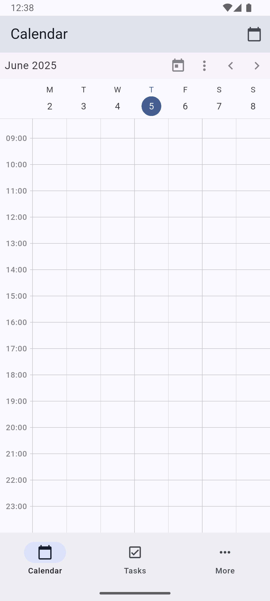 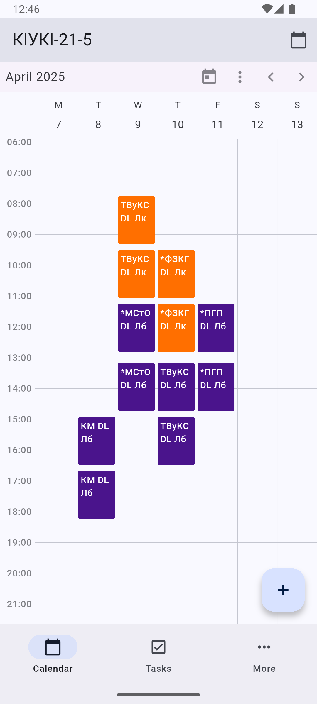  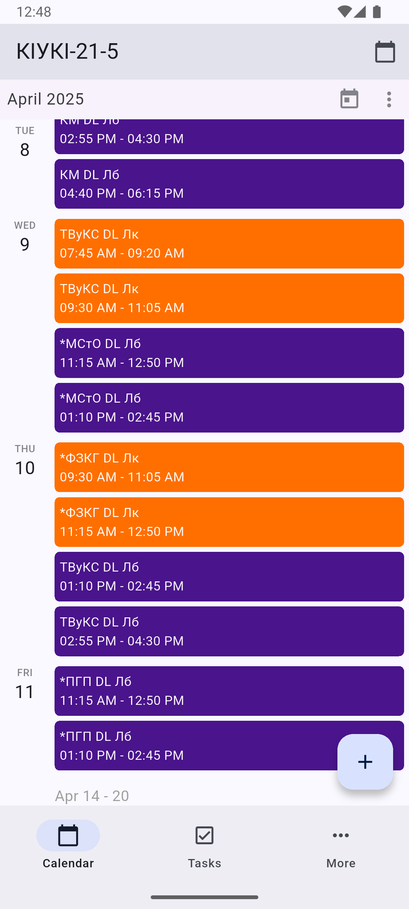 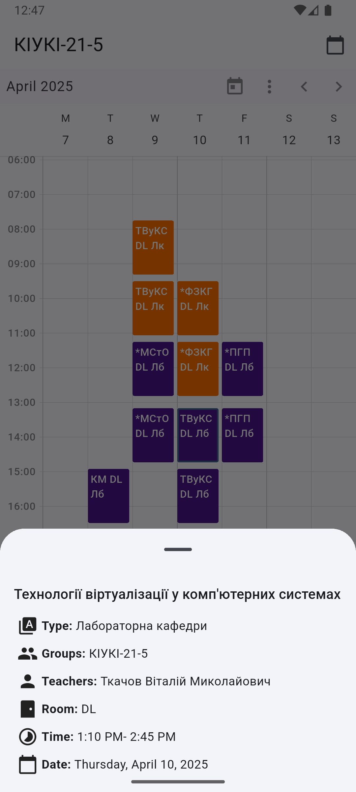 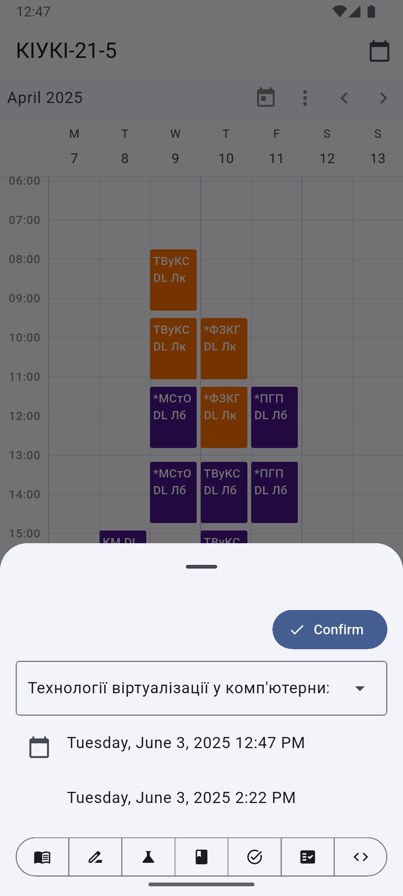

### Tasks

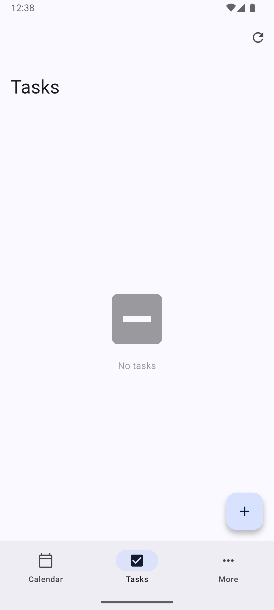 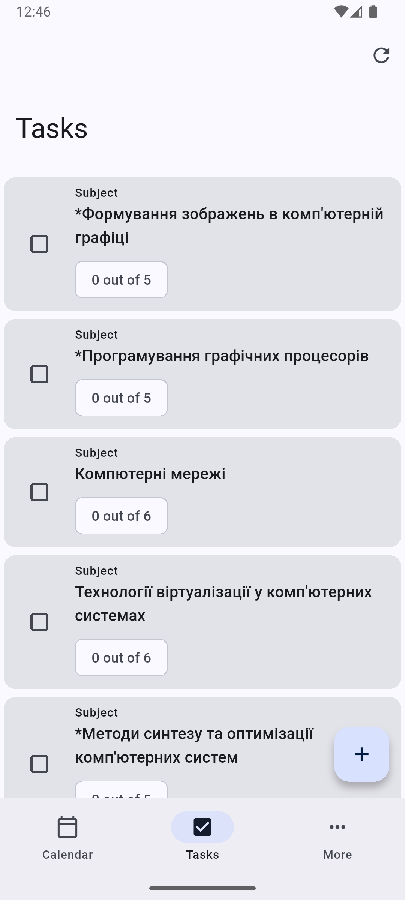 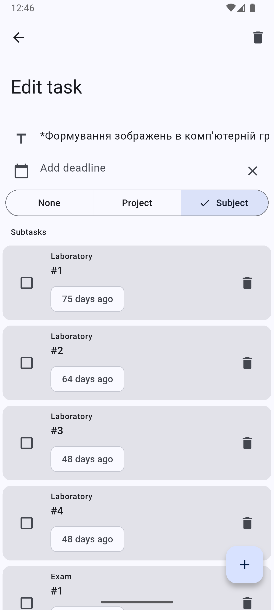 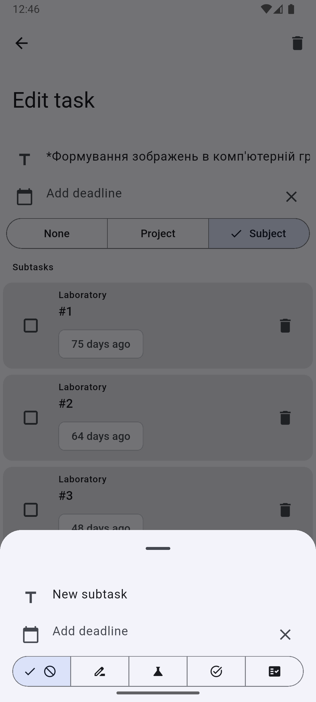

### Settings

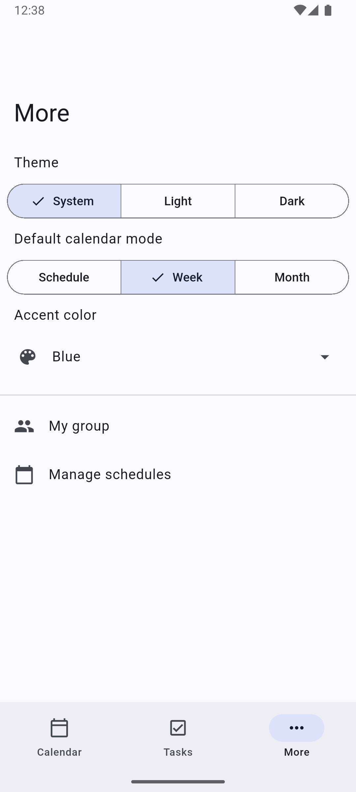 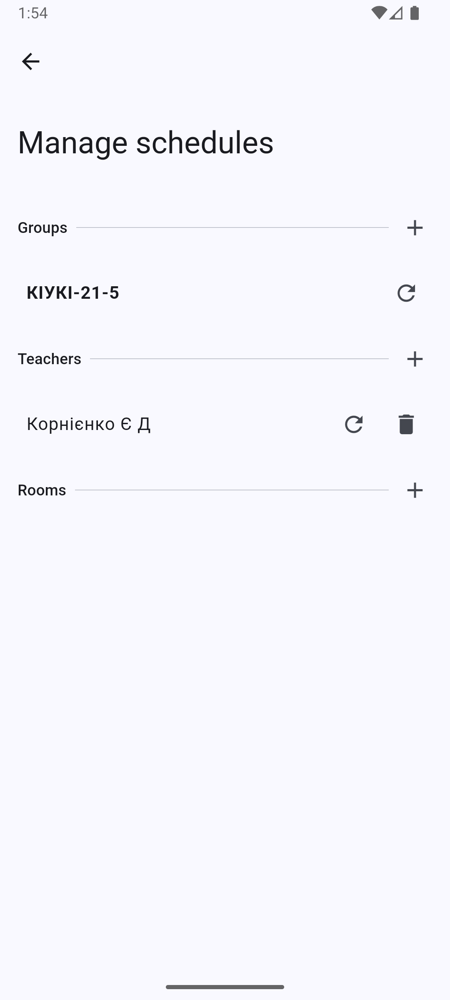 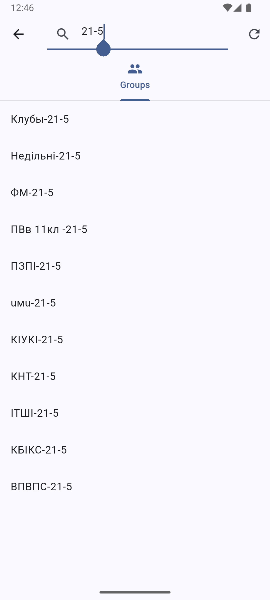

### Customization

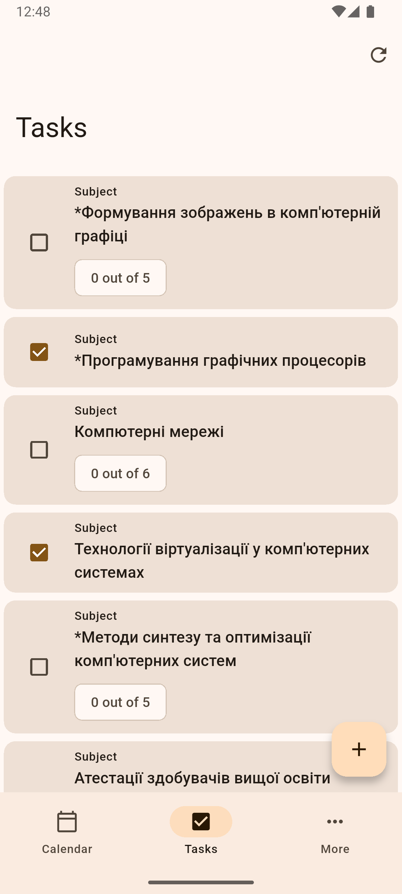 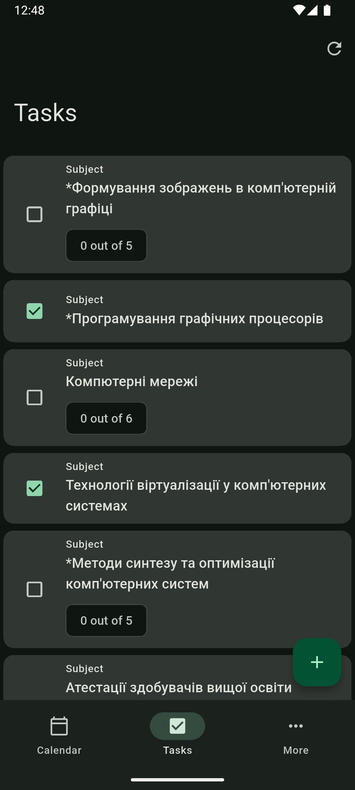

## Thanks to

- [Mindenit](https://github.com/mindenit/) for open-sourcing their work, specifically for [Nure.NET](https://github.com/mindenit/Nure.NET) from which endpoints for this project were taken
- [NureTimetable](https://github.com/maxkoshevoi/NureTimetable) for inspiration and ideas
